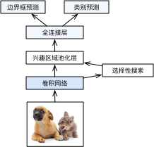
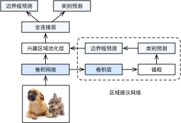
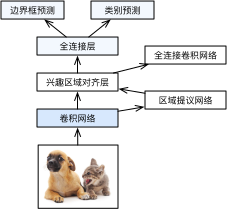

# 区域卷积神经网络（R-CNN）系列

区域卷积神经网络（Regions with CNN features，简称R-CNN）是使用深度模型来解决物体识别的开创性工作，这一小节我们将介绍它和它之后数个重要变种 [1]。但限于篇幅原因，这里主要介绍模型思路而不是具体实现。

## R-CNN：区域卷积神经网络

R-CNN的提出影响了后面一系列深度模型的设计。它首先对每张图片选取多个提议区域（例如之前介绍的锚框就是一种选取方法），然后使用卷积层来对每个区域抽取特征，以得到多个区域样本。之后我们对每个区域样本进行物体分类和真实边界框预测。图9.4描述了R-CNN模型。


具体来说，它的由四步构成：

1. 对每张输入图片使用选择性搜索来选取多个高质量的提议区域 [2]。这个算法先对图片基于像素信息做快速分割来得到多个区域，然后将当下最相似的两区域合并成一个区域，重复进行合并直到整张图片变成一个区域。最后根据合并的信息生成多个有层次结构的提议区域，并为每个提议区域生成物体类别和真实边界框。
1. 选取一个预先训练好的卷积神经网络，去掉最后的输出层来作为特征抽取模块。对每个提议区域，将其变形成卷积神经网络需要的输入尺寸后进行前向计算抽取特征。
1. 将每个提议区域的特征连同其标注做成一个样本，训练多个支持向量机（SVM）来进行物体类别分类，这里第$i$个SVM预测样本是否属于第$i$类。
1. 在这些样本上训练一个线性回归模型来预测真实边界框。

R-CNN对之前物体识别算法的主要改进是使用了预先训练好的卷积神经网络来抽取特征，有效的提升了识别精度。但Ｒ-CNN的一个主要缺点在于速度。对一张图片我们可能选出上千个兴趣区域，这样导致每张图片需要对卷积网络做上千次的前向计算。当然在训练的时候我们可以事先算好每个区域的特征并保存，因为训练中不更新卷积网络的权重。但在做预测时，我们仍然需要计算上千次的前向计算，其带来的巨大计算量使得RCNN很难在实际应用中被使用。

## Fast R-CNN：快速的区域卷积神经网络

R-CNN的主要性能瓶颈在于需要对每个提议区域独立的抽取特征。考虑到这些区域会有大量重叠，独立的特征抽取导致了大量的重复计算。Fast R-CNN对R-CNN的一个主要改进在于首先对整个图片进行特征抽取，然后再选取提议区域，从而减少重复计算 [3]。图9.5描述了Fast R-CNN模型。



Fast R-CNN跟R-CNN的主要不同在于下面四点：

1. 用来提取特征的卷积网络是作用在整个图片上，而不是各个提议区域上。而且这个卷积网络通常会参与训练，即更新权重。
1. 选择性搜索是作用在卷积网络的输出上，而不是原始图片上。
1. 在R-CNN里，我们将形状各异的提议区域变形到同样的形状来进行特征提取。Fast R-CNN则新引入了兴趣区域池化层（Region of Interest Pooling，简称RoI池化层）来对每个提议区域提取同样大小的输出以便输入之后的神经层。
1. 在物体分类时，Fast R-CNN不再使用多个SVM，而是像之前图片分类那样使用Softmax回归来进行多类预测。

Fast R-CNN中提出的RoI池化层跟我们之前介绍过的池化层有显著的不同。在池化层中，我们通过设置池化窗口、填充和步幅来控制输出大小，而RoI池化层里我们直接设置每个区域的输出大小。例如设置$n\times m$，那么对每一个区域我们得到$n\times m$形状输出。具体来说，我们将每个区域在高和宽上分别均匀划分$n$和$m$块，如果划分边界不是整数则定点化到最近的整数。然后对于每一个划分区域，我们输出其最大元素值。

图9.6中，我们在$4 \times 4$的输入上选取了左上角的$3\times 3$区域作为兴趣区域，经过$2\times 2$的RoI池化层后得到一个$2\times 2$的输出，其中每个输出元素需要的输入均由同色标注。


我们使用`nd.ROIPooling`来演示实际计算。假设输入特征高宽均为4且只有单通道。

```{.python .input  n=4}
from mxnet import nd

x = nd.arange(16).reshape((1, 1, 4, 4))
x
```

我们定义两个兴趣区域，每个区域由五个元素表示，分别为区域物体标号，左上角的x、y轴坐标和右下角的x、y轴坐标。

```{.python .input  n=5}
rois = nd.array([[0, 0, 0, 2, 2], [0, 0, 1, 3, 3]])
```

可以看到这里我们生成了$3\times 3$和$4\times 3$大小的两个区域。

RoI池化层的输出形状是（区域个数，输入通道数，$n$，$m$），一般被当做样本数的区域个数会作为批量值进入到接下来的神经网络中。下面函数输入中我们指定了输入特征、池化形状、和当前特征尺寸与原始图片尺寸的比例。

```{.python .input  n=6}
nd.ROIPooling(x, rois, pooled_size=(2, 2), spatial_scale=1)
```

## Faster R-CNN：更快速的区域卷积神经网络

Faster R-CNN 对Fast R-CNN做了进一步改进，它将Fast R-CNN中的选择性搜索替换成区域提议网络（region proposal network，简称RPN）[4]。RPN以锚框为起始点，通过一个小神经网络来选择提议区域。图9.7描述了Faster R-CNN模型。



具体来说，RPN里面有四个神经层。

1. 卷积网络抽取的特征首先进入1填充256通道的 $3\times 3$ 卷积层，这样每个像素得到一个256长度的特征表示。
1. 以每个像素为中心，生成多个大小和比例不同的锚框和对应的标注。每个锚框使用其中心像素对应的256维特征来表示。
1. 在锚框特征和标注上面训练一个两类分类器，判断其含有感兴趣物体还是只有背景。
1. 对每个被判断成含有物体的锚框，进一步预测其边界框，然后进入RoI池化层。

可以看到RPN通过标注来学习预测跟真实边界框更相近的提议区域，从而减小提议区域的数量同时保证最终模型的预测精度。

## Mask R-CNN：使用全连接卷积网络的Faster RCNN

如果训练数据中我们标注了每个物体的精确边框，而不是一个简单的方形边界框，那么Mask R-CNN能有效的利用这些详尽的标注信息来进一步提升物体识别精度 [5]。具体来说，Mask R-CNN使用额外的全连接卷积网络来利用像素级别标注信息，这个网络将在稍后的[“语义分割”](fcn.md)这一节做详细介绍。图9.8描述了Mask R-CNN模型。



注意到RPN输出的是实数坐标的提议区域，在输入到RoI池化层时我们将实数坐标定点化成整数来确定区域中的像素。在计算过程中，我们将每个区域分割成多块然后同样定点化区域边缘到最近的像素上。这两步定点化会使得定点化后的边缘和原始区域中定义的有数个像素的偏差，这个对于边界框预测来说问题不大，但在像素级别的预测上则会带来麻烦。

Mask R-CNN中提出了RoI对齐层（RoI Align）。它去掉了RoI池化层中的定点化过程，从而使得不管是输入的提议区域还是其分割区域的坐标均使用实数。如果边界不是整数，那么其元素值则通过相邻像素插值而来。例如假设对于整数$x$和$y$，坐标$(x,y)$上的值为$f(x,y)$。对于一般的实数坐标，我们先计算$f(x,\lfloor y \rfloor)$和$f(x,\lfloor y \rfloor+1)$，

$$f(x,\lfloor y \rfloor) = (\lfloor x \rfloor + 1-x)f(\lfloor x \rfloor, \lfloor y \rfloor) + (x-\lfloor x \rfloor)f(\lfloor x \rfloor + 1, \lfloor y \rfloor),$$
$$f(x,\lfloor y \rfloor+1) = (\lfloor x \rfloor + 1-x)f(\lfloor x \rfloor, \lfloor y \rfloor+1) + (x-\lfloor x \rfloor)f(\lfloor x \rfloor + 1, \lfloor y \rfloor+1).$$

然后有

$$f(x,y) = (\lfloor y \rfloor + 1-y)f(x, \lfloor y \rfloor) + (y-\lfloor y \rfloor)f(x, \lfloor y \rfloor + 1).$$


## 小结

* R-CNN对每张图片选取多个提议区域，然后使用卷积层来对每个区域抽取特征，之后对每个区域进行物体分类和真实边界框预测。
* Fast R-CNN对整个图片进行特征抽取后再选取提议区域来提升计算性能，它引入了兴趣区域池化层将每个提议区域提取同样大小的输出以便输入之后的神经层。
* Faster R-CNN引入区域提议网络来进一步简化区域提议流程。
* Mask R-CNN在Faster R-CNN基础上进入一个全卷积网络可以借助像素粒度的标注来进一步提升模型精度。


## 练习

* 介于篇幅原因这里没有提供R-CNN系列模型的实现。有兴趣的读者可以参考Gluon CV工具包（https://gluon-cv.mxnet.io/ ）来学习它们的实现。

## 扫码直达[讨论区](https://discuss.gluon.ai/t/topic/7219)


## 参考文献

[1] Girshick, R., Donahue, J., Darrell, T., & Malik, J. (2014). Rich feature hierarchies for accurate object detection and semantic segmentation. In Proceedings of the IEEE conference on computer vision and pattern recognition (pp. 580-587).

[2] Uijlings, J. R., Van De Sande, K. E., Gevers, T., & Smeulders, A. W. (2013). Selective search for object recognition. International journal of computer vision, 104(2), 154-171.

[3] Girshick, R. (2015). Fast r-cnn. arXiv preprint arXiv:1504.08083.

[4] Ren, S., He, K., Girshick, R., & Sun, J. (2015). Faster r-cnn: Towards real-time object detection with region proposal networks. In Advances in neural information processing systems (pp. 91-99).

[5] He, K., Gkioxari, G., Dollár, P., & Girshick, R. (2017, October). Mask r-cnn. In Computer Vision (ICCV), 2017 IEEE International Conference on (pp. 2980-2988). IEEE.
