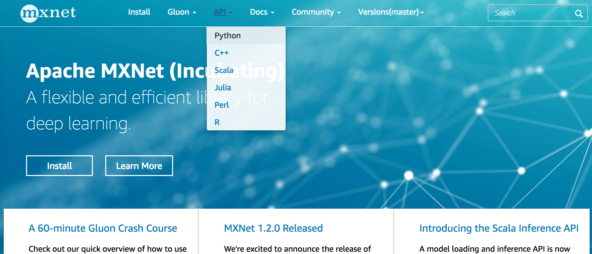

# 查阅MXNet文档

受篇幅所限，本书无法对所有MXNet的应用程序接口（API）一一介绍。每当遇到不熟悉的MXNet API时，我们可以主动查阅它的相关文档。


## 使用`dir`函数

我们可以使用`dir`函数查阅API中包含的成员或属性。打印`autograd`模块中所有的成员或属性。

```{.python .input  n=1}
from mxnet import autograd
print(dir(autograd))
```

## 使用`help`函数

当我们想了解API的具体用法时，可以使用`help`函数。让我们以NDArray中的`ones_like`函数为例，查阅它的用法。

```{.python .input}
from mxnet import nd
help(nd.ones_like) # 在 Jupyter notebook 中可使用问号查询，例如 nd.ones_like?
```

从文档信息我们了解到，`ones_like`函数会创建和输入NDArray形状相同且元素为1的新的NDArray。我们可以验证一下：

```{.python .input}
x = nd.array([[0,0,0], [2,2,2]])
y = x.ones_like()
y
```

## 在MXNet网站上查阅

我们也可以在MXNet的网站上查阅API的相关文档。访问MXNet网站（mxnet.apache.org）。如图2.1所示，点击网页顶部的下拉菜单“API”可查阅各个前端语言的API。此外，我们也可以在网页右上方含“Search”字样的搜索框中直接搜索API名称。



图2.2展示了MXNet网站上有关`ones_like`函数的文档。


## 小结

* 每当遇到不熟悉的MXNet API时，我们可以主动查阅它的相关文档。
* 查阅MXNet文档可以使用`dir`和`help`函数，或访问MXNet官网。


## 练习

* 查阅NDArray支持的其他操作。


## 扫码直达[讨论区](https://discuss.gluon.ai/t/topic/7116)


