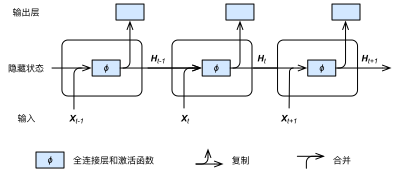

# 隐藏状态

上一节介绍的$n$元语法中，基于文本序列最近$n-1$个词生成时间步$t$的词$w_t$的条件概率为

$$\mathbb{P}(w_t \mid w_{t-(n-1)}, \ldots, w_{t-1}).$$

需要注意的是，以上概率并没有考虑到比$t-(n-1)$更早时间步的词对$w_t$可能的影响。然而，考虑这些影响需要增大$n$的值，那么$n$元语法的模型参数的数量将随之呈指数级增长（可参考上一节的练习）。为了解决$n$元语法的局限性，我们可以在神经网络中引入隐藏状态。我们既要捕捉时间序列的历史信息，又希望模型参数的数量不随历史增长而增长。

## 不含隐藏状态的神经网络

让我们先回顾一下不含隐藏状态的神经网络，例如只有一个隐藏层的多层感知机。给定样本数为$n$、输入个数（特征数或特征向量维度）为$d$的小批量数据样本$\boldsymbol{X} \in \mathbb{R}^{n \times d}$。设隐藏层的激活函数为$\phi$，那么隐藏层的输出$\boldsymbol{H} \in \mathbb{R}^{n \times h}$计算为

$$\boldsymbol{H} = \phi(\boldsymbol{X} \boldsymbol{W}_{xh} + \boldsymbol{b}_h),$$

其中权重参数$\boldsymbol{W}_{xh} \in \mathbb{R}^{d \times h}$，偏差参数 $\boldsymbol{b}_h \in \mathbb{R}^{1 \times h}$，$h$为隐藏单元个数。上式相加的两项形状不同，因此将按照广播机制相加（参见[“数据操作”](../chapter_prerequisite/ndarray.md)一节）。把隐藏变量$\boldsymbol{H}$作为输出层的输入，且设输出个数为$q$（例如分类问题中的类别数），输出层的输出

$$\boldsymbol{O} = \boldsymbol{H} \boldsymbol{W}_{hy} + \boldsymbol{b}_y,$$

其中输出变量$\boldsymbol{O} \in \mathbb{R}^{n \times q}$, 输出层权重参数$\boldsymbol{W}_{hy} \in \mathbb{R}^{h \times q}$, 输出层偏差参数$\boldsymbol{b}_y \in \mathbb{R}^{1 \times q}$。如果是分类问题，我们可以使用$\text{softmax}(\boldsymbol{O})$来计算输出类别的概率分布。

## 含隐藏状态的循环神经网络

现在我们考虑时间序列数据，并基于上面描述的多层感知机引入隐藏状态，从而构造循环神经网络。假设$\boldsymbol{X}_t \in \mathbb{R}^{n \times d}$是序列中时间步$t$的小批量输入（样本数为$n$，输入个数为$d$），该时间步隐藏层变量是$\boldsymbol{H}_t  \in \mathbb{R}^{n \times h}$（隐藏单元个数为$h$，是超参数），输出层变量是$\boldsymbol{O}_t \in \mathbb{R}^{n \times q}$（输出个数为$q$）。

为了使隐藏层变量能够捕捉时间序列的历史信息，我们引入一个新的权重参数$\boldsymbol{W}_{hh} \in \mathbb{R}^{h \times h}$，并且使当前时间步隐藏层变量同时取决于当前时间步输入$\boldsymbol{X}_t$和上一时间步隐藏层变量$\boldsymbol{H}_{t-1} \in \mathbb{R}^{n \times h}$：

$$\boldsymbol{H}_t = \phi(\boldsymbol{X}_t \boldsymbol{W}_{xh} + \boldsymbol{H}_{t-1} \boldsymbol{W}_{hh}  + \boldsymbol{b}_h).$$

这里的隐藏层变量又叫隐藏状态。通常，我们会将隐藏状态全部元素初始化为0。隐藏状态捕捉了截至当前时间步的序列历史信息，就像是神经网络当前时间步的状态或记忆一样。神经网络下一时间步的隐藏状态既取决于下一时间步的输入，又取决于当前时间步的隐藏状态。如此循环往复。我们将此类神经网络称作循环神经网络。

在时间步$t$，循环神经网络的输出层输出和多层感知机中的计算类似：

$$\boldsymbol{O}_t = \boldsymbol{H}_t \boldsymbol{W}_{hy} + \boldsymbol{b}_y.$$

图6.1展示了循环神经网络在三个时间步的计算逻辑。在时间步$t$，输入$\boldsymbol{X}_t$和前一时间步隐藏状态$\boldsymbol{H}_{t-1}$同时输入一个激活函数为$\phi$的全连接层。该全连接层的输出就是当前时间步的隐藏状态$\boldsymbol{H}_t$。当前时间步的隐藏状态将参与下一个时间步的隐藏状态的计算，并输入到当前时间步的全连接输出层。

循环神经网络的参数包括隐藏层的权重$\boldsymbol{W}_{xh} \in \mathbb{R}^{d \times h}, \boldsymbol{W}_{hh} \in \mathbb{R}^{h \times h}$和偏差 $\boldsymbol{b}_h \in \mathbb{R}^{1 \times h}$，以及输出层的权重$\boldsymbol{W}_{hy} \in \mathbb{R}^{h \times q}$和偏差$\boldsymbol{b}_y \in \mathbb{R}^{1 \times q}$。值得一提的是，即便在不同时间步，循环神经网络始终使用这些模型参数。因此，循环神经网络模型参数的数量不随历史增长而增长。

## 小结

* 循环神经网络通过引入隐藏状态来捕捉时间序列的历史信息。
* 循环神经网络模型参数的数量不随历史增长而增长。

## 练习

* 如果我们使用循环神经网络来预测一段文本序列的下一个词，输出个数应该是多少？
* 为什么循环神经网络可以表达某时间步的词基于文本序列中所有过去的词的条件概率？

## 扫码直达[讨论区](https://discuss.gluon.ai/t/topic/6669)

